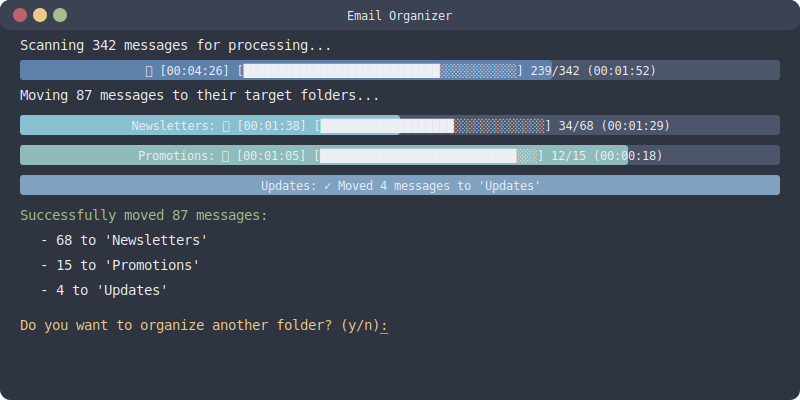

# IMAP Filter

A Rust-based IMAP email organizer that uses rules and optional AI to automatically sort your emails into folders.

## Demo



The program automatically organizes your emails using both rule-based filtering and optional AI classification, providing real-time progress and clear summaries of actions taken.

## Getting Started

1. Clone the repository
2. Copy the example configuration:
   ```bash
   cp config.example.toml config.toml
   ```
3. Edit `config.toml` with your settings:
   - Update IMAP server details
   - Configure your email sorting rules
   - Optionally enable AI features

## Configuration

The configuration can be provided in two ways:
1. Via `config.toml` file (recommended for most settings)
2. Via environment variables (recommended for sensitive data)

### Environment Variables

Sensitive information can be provided via environment variables:
```bash
export IMAP_PASSWORD="your_password"
export IMAP_USERNAME="your.email@example.com"  # overrides config file
export IMAP_SERVER="imap.example.com"          # overrides config file
```

### Configuration File Format

```toml
# Server configuration
server = "imap.example.com"     # or use IMAP_SERVER env var
username = "user@example.com"   # or use IMAP_USERNAME env var
target_folder = "INBOX/Newsletters"
source_folder = "INBOX"  # Optional, defaults to "INBOX"

# AI configuration
use_ai = false          # Use AI-based classification
use_hybrid = true       # Use hybrid mode (rules + AI)
model = "gemma-2b-it"   # Optional AI model name
lmstudio_url = "http://localhost:1234"  # Optional LMStudio URL
skip_confirmation = true  # Skip confirmation prompt (same as --yes)

# Email classification rules
[[subject_rules]]
pattern = "(?i)newsletter"
description = "Company newsletters"
folder = "Newsletters"

[[sender_rules]]
pattern = "news@example\\.com"
description = "Example.com news"
folder = "Company/News"
```

You can specify settings either in the config file or via command line arguments. Command line arguments take precedence over config file settings.

## Security Notes

1. Never commit sensitive information to the repository:
   - IMAP passwords
   - Email credentials
   - Private keys
   - Personal configuration

2. Use environment variables for sensitive data
3. The `config.toml` in the repository should only contain your rules and non-sensitive settings
4. If you need to share your configuration, use `config.example.toml` as a template

## Command Line Usage

```bash
# Using config file (recommended)
imap-filter --config config.toml

# Override some config settings
imap-filter --config config.toml --target "Different/Folder"

# Using environment variables
IMAP_PASSWORD="secret" imap-filter --config config.toml
```

# ... rest of the content ... 